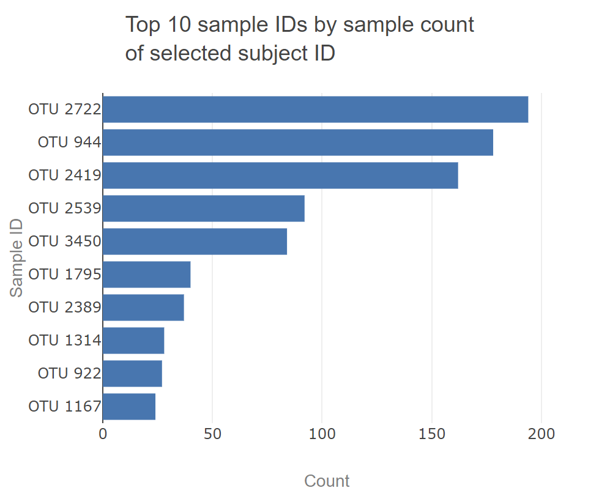
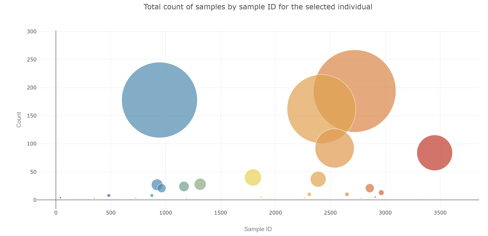
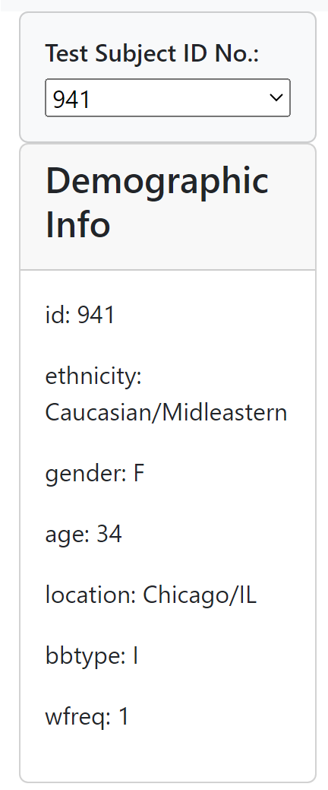
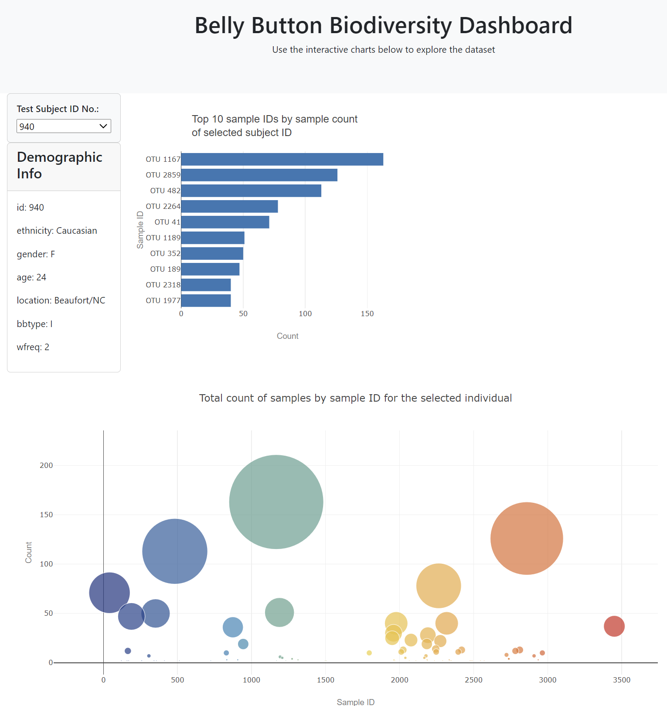

# belly-button-challenge

## Objective

Call JavaScript code from within HTML to create a site with interactive charts exploring the belly button biodiversity dataset (microbes that colonise human navels)

## Method and Results

* Use the D3 library to read in `samples.json` from the URL `https://static.bc-edx.com/data/dl-1-2/m14/lms/starter/samples.json`
  
* Create a horizontal bar chart with a dropdown menu to display the top 10 OTUs found in that individual  
  
* Create a bubble chart that displays all samples  
  
* Display each key-value pair from the metadata JSON object on the dashboard in the Demographic Info card  
  
* Create an interactive dashboard that updates upon user selection of test subject ID number  
  
* Deploy app to a free static page hosting service on GitHub Pages: `https://htojyy.github.io/belly-button-challenge/`

## References

* Hulcr, J. et al. (2012) A Jungle in There: Bacteria in Belly Buttons are Highly Diverse, but Predictable. Retrieved from: <http://robdunnlab.com/projects/belly-button-biodiversity/results-and-data/>
* [Use array to create dropdown list text](https://www.quora.com/How-do-you-create-a-drop-down-list-in-JavaScript-using-an-array-as-the-data-source)
* [Set default dropdown option](https://www.flowradar.com/answer/webflow-setting-default-option-select-dropdown-button-using-basic-javascript#:~:text=options%5B0%5D%60%20selects%20the,selection%20when%20the%20page%20loads)
* [Check if value exists in array index](https://www.geeksforgeeks.org/how-to-check-a-value-exist-at-certain-array-index-in-javascript/)
* [Plotly colour scales](//https://plotly.com/javascript/colorscales/)
* [Get the container element and create a new element](https://www.linkedin.com/pulse/javascript-create-interactive-elements-within-your-page-svekis-#:~:text=createElement()%20method%20in%20JavaScript,creates%20a%20new%20div%20element)
* [Get a key value pair from object](https://stackoverflow.com/questions/11279093/how-to-get-a-listing-of-key-value-pairs-in-an-object)
